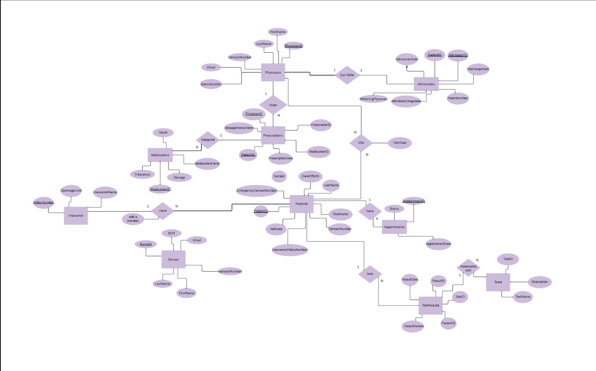
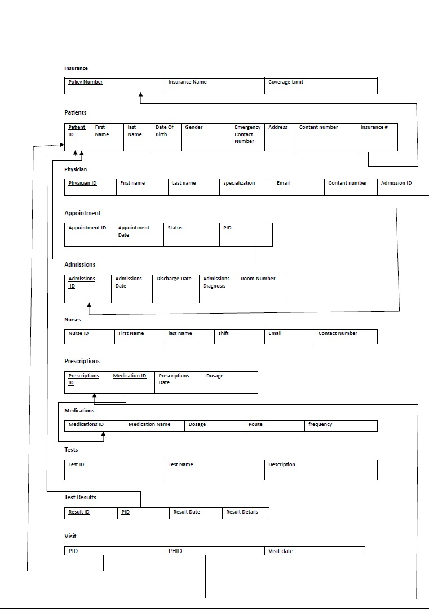

# Hospital Database System

## Overview
A hospital database system designed using SQL to manage patients, doctors, appointments, and medical data.

## Database Design

### ERD Diagram

### Relational Model

## Features
- Patient management
- Doctor and appointment tracking
- Test results and prescriptions
- Insurance handling

## Technologies
- SQL

## Author
Waleed Thabit
